# Vue-Studies

## Steps to execute tests - **updateDOMVue2.html**

> Execute the **.html** file.
>
>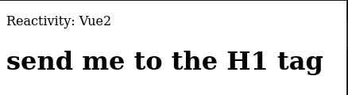

> Open the browser terminal, and in the tab **Console** execute the command below:
>> <code>info.reactive_msg = 'okay'</code>
>>
>> The innerText of the **H1** tag, will be updated and the new value will be assigned to the **msg** property.
>> It means that the innerText of the **H1** tag is sync with the **msg** property.
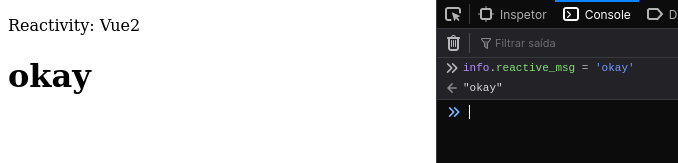

## Steps to execute tests - **updateDOMVue3.html**

> Open the **.html** file.
>
>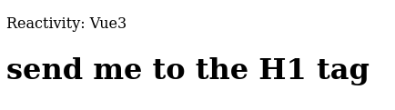

> Open the browser terminal, and in the tab **Console** execute the command below:
>> <code>info_proxy.msg</code>
>>
>> 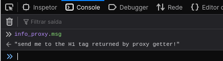
>> 
>> **RETURN**: send me to the H1 tag returned by proxy getter!
>> 
>>>> In this case, the proxy getter returned the **H1** tag text (**send me to the H1 tag**) + the guetter text (**returned by proxy getter!**).
>>
>> Now if i send a new command setting a new value:
>>
>> <code>info_proxy.msg = 'okay'</code>
>>
>> 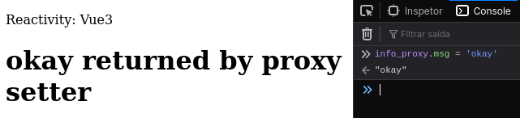
>>
>> **RETURN**: okay returned by proxy setter
>> 
>>>> The innerText of the **H1** tag will be updated and the new value will be assigned to the **msg** property.
>> It means that the innerText of the **H1** tag is sync with the **msg** property.
>>
>> I can check the value of the **num** property.
>> 
>> <code>info_proxy.num</code>
>>
>> 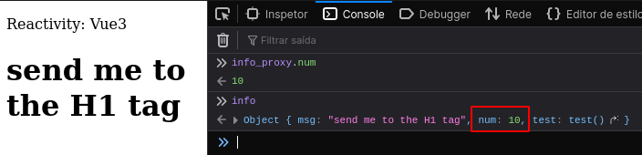
>>
>> 
>> **RETURN**: 10
>> 
>> And i can set a new value to this property, as i did with the **msg** property
>> 
>> <code>info_proxy.num++</code>
>>
>> 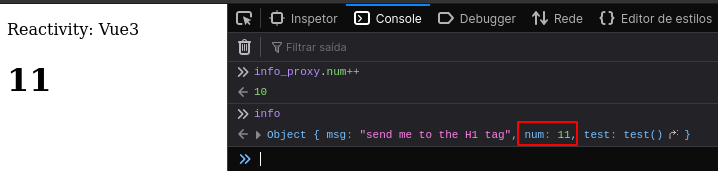
>>
>> 
>> **RETURN**: 11

## Steps to execute tests - **singletonAndFactory.html**

> Open the **.html** file
>
> Open the browser terminal, and in the tab **Console** execute the command below:

### Singleton Pattern

>> <code>instance_aS</code>
>>
>> 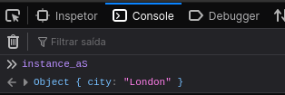
>> 
>> 
>> <code>instance_bS</code>
>>
>> 
>>
>> 
>> <code>info</code>
>>
>> 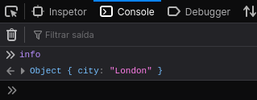
>>
>> Setting a new value to the city name:
>> 
>> <code>instance_bS.city = 'okay'</code>
>>
>> Checking the values:
>> 
>> <code>instance_aS, </code>
>> <code>instance_bS, </code>
>> <code>info</code>
>> 
>> 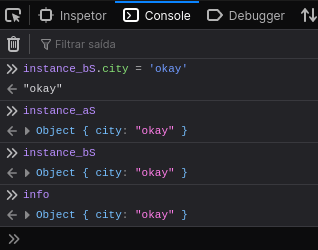
>>
>> 

### Factory Pattern

>> <code>instance_aF</code>
>> 
>> 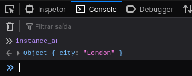
>>
>> 
>> <code>instance_bF</code>
>> 
>> 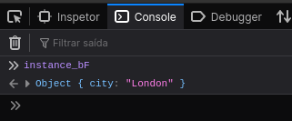
>>
>> Settin a new value to the city name:
>> 
>> <code>instance_bF.city = 'okay'</code>
>>
>> Checking the values:
>> 
>> <code>instance_aF, </code>
>> <code>instance_bF</code>
>> 
>> 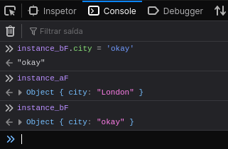

## Steps to execute tests - **refAttribute.html**

> Open the **.html** file
>
> Open the browser terminal, and in the tab **Console** execute the command below:
>> 
>> <code>vm.$refs</code> 
>> 
>> 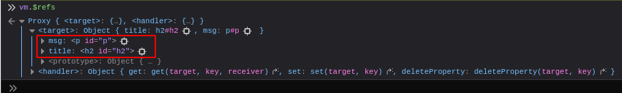
>>
>> We can see the proxy object **$refs** and his two properties, **msg** and **title**. These two property names are the same  as the **ref** values i set in the **h2** and **p** tag. 
>> The property values are de **DOM** objects of **h2** and **p** tags.
>> 
>> 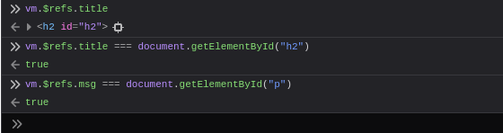
>>
>> The proxy object in **Vue 3** means reactivity, so the **$refs**'s object properties are all reactive, they all return the latest **DOM** objects.
>> 
>> Then if i update the **vm.title** property the return of **$refs** must be the new value:
>> 
>> 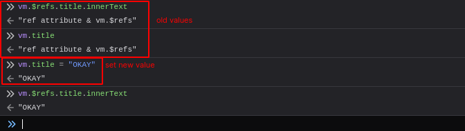
>>